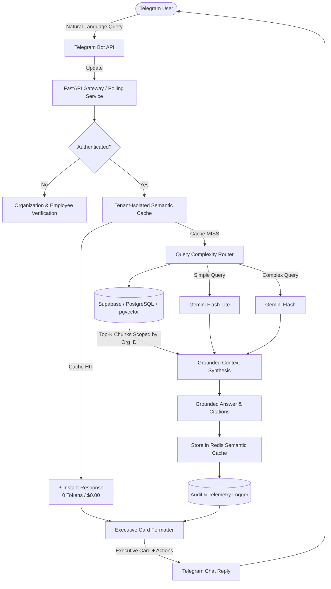

# 🏢 Enterprise AI Telegram Assistant

[](https://www.python.org/)
[](https://fastapi.tiangolo.com)
[](https://core.telegram.org/bots/api)
[](https://github.com/pgvector/pgvector)
[](https://redis.io)
[](https://ai.google.dev)
[](LICENSE)

A production-grade, multi-tenant enterprise **Retrieval-Augmented Generation (RAG)** assistant deployed directly on Telegram. Employees authenticate via frictionless one-tap company verification to query proprietary policies, manuals, and internal documentation. Administrators receive real-time AI observability, token usage tracking, and document knowledge base controls.

---

## 📑 Table of Contents

- [Key Features](#-key-features)
- [System Architecture](#-system-architecture)
- [Telegram Interface & User Experience](#-telegram-interface--user-experience)
- [Project Structure](#-project-structure)
- [Quick Start Guide](#-quick-start-guide)
  - [Prerequisites](#prerequisites)
  - [Local Development Setup](#local-development-setup)
  - [Docker Compose Setup](#docker-compose-setup)
- [Environment Configuration](#-environment-configuration)
- [REST API Endpoints](#-rest-api-endpoints)
- [Multi-Tenancy & Security Model](#-multi-tenancy--security-model)
- [Automated Testing](#-automated-testing)
- [License](#-license)

---

## ✨ Key Features

| Feature | Description |
| :--- | :--- |
| **🏢 Strict Multi-Tenancy** | Every query, vector embedding, and cache entry is partitioned by `organization_id` using pgvector cosine distance (`<=>`). Zero cross-tenant data leakage. |
| **⚡ Semantic Caching** | High-performance Redis cosine similarity matching. Semantically identical questions receive instant answers at **$0.00 cost** and **<20ms latency**. |
| **🧭 Query Complexity Router** | Modular, explainable analyzer assessing query depth, length, and reasoning requirements to dynamically route queries between **Gemini Flash-Lite** and **Gemini Flash**. |
| **🎨 Modern Executive Card UI** | Telegram answers are formatted as clean cards featuring company branding, divider rules, verified footnotes, and interactive feedback buttons (`👍` / `👎`). |
| **📄 On-Demand Sources Modal** | Citations are discreetly attached as an interactive `[ 📄 View Sources ]` button that opens a native Telegram popup without cluttering the chat history. |
| **🔐 One-Tap Employee Authentication** | Passwordless login: user selects their organization and enters their Employee ID, then verifies with a single tap on `[ ✅ Confirm & Sign In ]`. |
| **📊 Real-Time Admin Telemetry** | Organization administrators can inspect token usage, query costs, average latency, and cache hit rates directly within Telegram via `/admin`. |
| **📁 In-Chat Document Ingestion** | Administrators can drag and drop PDFs or TXT files directly into Telegram to extract, chunk, embed, and index them into pgvector automatically. |

---

## 🏛️ System Architecture



---

## 📱 Telegram Interface & User Experience

### 1. Frictionless Employee Login Flow
```text
User:   /start

Bot:    🏢 Enterprise Assistant Portal
        ━━━━━━━━━━━━━━━━━━━━━━━
        To access your company's documents, please enter your 
        Organization ID or Organization Name:
        (e.g. acme_corp_001 or Acme Corporation)

User:   acme_corp_001

Bot:    🏢 Organization: Acme Corporation
        ━━━━━━━━━━━━━━━━━━━━━━━
        Please enter your Employee ID (e.g. EMP-001):

User:   EMP-001

Bot:    👤 Employee Profile Identified
        ━━━━━━━━━━━━━━━━━━━━━━━
        • Name: Alice Smith
        • Employee ID: EMP-001
        • Organization: Acme Corporation

        Tap Confirm & Sign In below to authenticate:
        [ ✅ Confirm & Sign In ]   [ ❌ Cancel ]

User:   [ Taps 'Confirm & Sign In' ]

Bot:    🏢 Acme Corporation Knowledge Base
        ━━━━━━━━━━━━━━━━━━━━━━━
        👋 Welcome, Alice Smith!
        Authentication successful ✅

        You can now ask questions about your organization's documents.
```

### 2. Modern Executive Card Answer
```text
User:   How many days can we work from home?

Bot:    🏢 Acme Corporation Knowledge Base
        ━━━━━━━━━━━━━━━━━━━━━━━
        Based on Acme Corporation's Flexible & Remote Work Guidelines:

        Full-time team members are permitted to work remotely for up to 
        3 days per week, with a minimum requirement of 2 days on-site at 
        their designated company office.

        Additionally, employees in good standing may request up to 30 
        business days per calendar year to work remotely from an approved 
        international location.
        ━━━━━━━━━━━━━━━━━━━━━━━
        ✨ Verified from official company documents

        [ 👍 Helpful ]   [ 👎 Not Helpful ]
        [         📄 View Sources         ]
```

* Tapping **`👍 Helpful`** or **`👎 Not Helpful`** sends a native toast confirmation.
* Tapping **`📄 View Sources`** opens a native Telegram popup listing verified sources (`• acme_wfh_policy.txt`), keeping chat records clean.

---

## 📂 Project Structure

```text
rag-assistant/
├── app/
│   ├── main.py                     # FastAPI application & lifespan management
│   ├── config.py                   # Pydantic v2 Settings & environment mapping
│   ├── admin/                      # Admin analytics & command handlers
│   │   ├── analytics.py            # Aggregate metrics, costs & query streams
│   │   └── handlers.py             # Org creation, user addition & document actions
│   ├── auth/                       # Authentication & session state management
│   │   ├── service.py              # One-tap auth machine & org lookup
│   │   ├── session.py              # UserSession data model & AuthState enum
│   │   └── otp.py                  # Core OTP generation & verification service
│   ├── cache/                      # Multi-tenant semantic cache
│   │   └── semantic_cache.py       # Redis vector matching with in-memory fallback
│   ├── db/                         # Database layer
│   │   ├── database.py             # Async SQLAlchemy engine & session factory
│   │   ├── models.py               # Declarative models (Tenant, User, Doc, QueryLog)
│   │   └── repositories.py         # Async repositories & pgvector queries
│   ├── rag/                        # Retrieval-Augmented Generation core
│   │   ├── ingestion.py            # PDF/TXT extraction, chunking & vector indexing
│   │   ├── chunking.py             # Recursive paragraph-aware text chunker
│   │   ├── embeddings.py           # Gemini embedding client with fallback
│   │   ├── retrieval.py            # Multi-tenant filtered pgvector retrieval
│   │   └── generation.py           # Grounded response synthesis with guardrails
│   ├── router/                     # Explainable Model Routing
│   │   └── model_router.py         # Heuristic complexity scorer (Flash vs Flash-Lite)
│   ├── services/                   # Background services
│   │   ├── usage_tracker.py        # Asynchronous token and cost telemetry logging
│   │   └── document_service.py     # Document lifecycle & storage orchestration
│   └── telegram/                   # Telegram Bot Interface
│       ├── bot.py                  # Application builder & update dispatcher
│       ├── handlers.py             # Executive card replies, callbacks & routing
│       └── keyboards.py            # Interactive inline keypads & action buttons
├── scripts/                        # Database migration, sync & seed scripts
│   ├── init_db.py                  # Table & pgvector extension initialization
│   ├── seed_data.py                # Seeds sample organizations, users & policies
│   ├── supabase_schema.sql         # Direct SQL schema for Supabase migrations
│   └── sample_documents/           # Sample leave, remote work & compensation policies
├── tests/                          # Automated Pytest suite
│   ├── conftest.py                 # Async test fixtures and isolated databases
│   ├── test_multi_tenancy.py       # Strict cross-tenant isolation tests
│   ├── test_semantic_cache.py      # Cache hit, miss, and similarity tests
│   ├── test_rag_pipeline.py        # Grounded answering & hallucination prevention tests
│   ├── test_model_router.py        # Complexity scoring & model selection tests
│   ├── test_auth_service.py        # One-tap login & session persistence tests
│   └── test_admin_analytics.py     # Token accounting and latency tests
├── Dockerfile                      # Production container image definition
├── docker-compose.yml              # Local pgvector & Redis service orchestration
├── requirements.txt                # Pinned production Python dependencies
├── .env.example                    # Environment variable template
├── LICENSE                         # MIT License
└── README.md                       # Documentation
```

---

## ⚡ Quick Start Guide

### Prerequisites
* Python 3.11 or higher
* A Telegram Bot Token from [@BotFather](https://t.me/BotFather)
* A Google Gemini API Key from [Google AI Studio](https://aistudio.google.com/app/apikey)
* *(Optional)* Docker & Docker Compose

---

### Local Development Setup

1. **Clone the repository:**
   ```bash
   git clone https://github.com/<your-username>/rag-assistant.git
   cd rag-assistant
   ```

2. **Create and activate a virtual environment:**
   ```bash
   python -m venv .venv
   # On Windows:
   .venv\Scripts\activate
   # On Linux/macOS:
   source .venv/bin/activate
   ```

3. **Install dependencies:**
   ```bash
   pip install -r requirements.txt
   ```

4. **Configure environment variables:**
   ```bash
   cp .env.example .env
   ```
   Edit `.env` and supply your credentials:
   ```dotenv
   TELEGRAM_BOT_TOKEN="your_bot_token_from_botfather"
   GEMINI_API_KEY="your_gemini_api_key"
   ```

5. **Initialize and Seed Database:**
   ```bash
   # Initialize tables
   python scripts/init_db.py

   # Seed sample organizations (Acme Corp & Globex), users, and documents
   python scripts/seed_data.py
   ```

6. **Start the application:**
   ```bash
   python -m uvicorn app.main:app --reload --port 8000
   ```
   The bot will begin polling Telegram immediately. Open Telegram and send `/start` to begin chatting.

---

### Docker Compose Setup

Run the full production stack including PostgreSQL with `pgvector` and `redis:7-alpine`:

```bash
# 1. Copy and configure .env
cp .env.example .env

# 2. Build and launch services
docker compose up --build -d

# 3. Seed demo data inside the container
docker compose exec app python scripts/seed_data.py

# 4. Verify service health
curl http://localhost:8000/health
```

---

## ⚙️ Environment Configuration

| Variable | Default | Description |
| :--- | :--- | :--- |
| `TELEGRAM_BOT_TOKEN` | *Required* | Bot Token issued by `@BotFather`. |
| `TELEGRAM_MODE` | `polling` | `polling` for development; `webhook` for production. |
| `TELEGRAM_WEBHOOK_URL` | `null` | Public HTTPS endpoint when running in webhook mode. |
| `DATABASE_URL` | *SQLite fallback* | SQLAlchemy async database connection URI (PostgreSQL / Supabase). |
| `SUPABASE_URL` | `""` | Supabase project URL for remote document storage. |
| `SUPABASE_SERVICE_ROLE_KEY` | `""` | Supabase service role secret key. |
| `REDIS_URL` | `redis://localhost:6379/0`| Redis connection URL for semantic cache. |
| `GEMINI_API_KEY` | *Required* | Google Gemini API key from AI Studio. |
| `GEMINI_MODEL_SIMPLE` | `gemini-2.0-flash-lite` | Model chosen for straightforward factual queries. |
| `GEMINI_MODEL_COMPLEX` | `gemini-2.0-flash` | Model chosen for multi-step reasoning queries. |
| `GEMINI_EMBEDDING_MODEL`| `models/text-embedding-004` | 768-dimensional text embedding model. |
| `SEMANTIC_CACHE_THRESHOLD` | `0.90` | Cosine similarity cutoff for returning cached answers. |
| `RAG_TOP_K` | `4` | Number of document chunks retrieved per query. |
| `RAG_SIMILARITY_THRESHOLD` | `0.45` | Minimum chunk cosine similarity threshold. |
| `SHOW_DEBUG_BADGES` | `false` | When `true`, displays latency, cost, and tokens below answers. |

---

## 🌐 REST API Endpoints

Interactive Swagger UI documentation is available at `http://localhost:8000/docs`.

| Method | Endpoint | Description |
| :--- | :--- | :--- |
| `GET` | `/health` | Application, database, and cache readiness status. |
| `POST`| `/api/documents/upload` | Multipart file upload for enterprise document ingestion. |
| `GET` | `/api/documents/{org_id}` | Catalog of all indexed documents for a specific organization. |
| `GET` | `/api/admin/stats/{org_id}` | Aggregated metrics: queries, cache hit rate, cost & latency. |
| `GET` | `/api/admin/users/{org_id}` | User-level breakdown of query volume and token usage. |
| `GET` | `/api/admin/usage/{org_id}` | Live chronological audit log of processed queries. |
| `POST`| `/api/telegram/webhook` | Webhook receiver for production Telegram updates. |

---

## 🔒 Multi-Tenancy & Security Model

To satisfy enterprise compliance and prevent cross-tenant data leakage:
1. **Schema Partitioning**: All records (`documents`, `document_chunks`, `users`, and `query_logs`) include foreign keys to `organization_id`.
2. **Retrieval Isolation**: pgvector searches strictly enforce organization-level scoping:
   ```sql
   SELECT content, metadata, 1 - (embedding <=> :query_vec) AS similarity
   FROM document_chunks
   WHERE organization_id = :org_id
   ORDER BY embedding <=> :query_vec
   LIMIT :top_k;
   ```
3. **Semantic Cache Partitioning**: Redis cache keys and sets are namespaced per organization:
   ```text
   semantic_cache:entry:{org_id}:{entry_id}
   semantic_cache:org:{org_id}:keys
   ```
4. **Anti-Hallucination Guardrails**: Prompts explicitly mandate: *"If the answer cannot be found in the provided context, respond: 'I couldn't find this information in your organization's documents.' Do not hallucinate."*

---

## 🧪 Automated Testing

The test suite validates semantic caching, model routing, multi-tenancy boundaries, and grounded generation:

```bash
python -m pytest -v
```

```text
tests/test_admin_analytics.py ....                       [ 20%]
tests/test_admin_roles.py ....                           [ 40%]
tests/test_auth_service.py ..                            [ 50%]
tests/test_config.py ..                                  [ 60%]
tests/test_model_router.py ....                          [ 80%]
tests/test_multi_tenancy.py .                            [ 85%]
tests/test_rag_pipeline.py ...                           [ 95%]
tests/test_semantic_cache.py ..                          [100%]

============================== 20 passed in 9.87s ===============================
```

---

## 📄 License

This project is licensed under the MIT License - see the [LICENSE](LICENSE) file for details.
